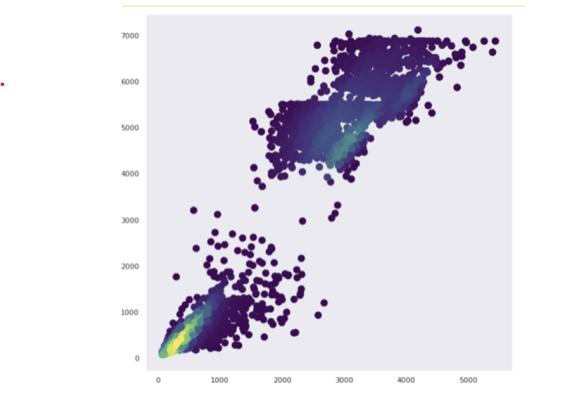
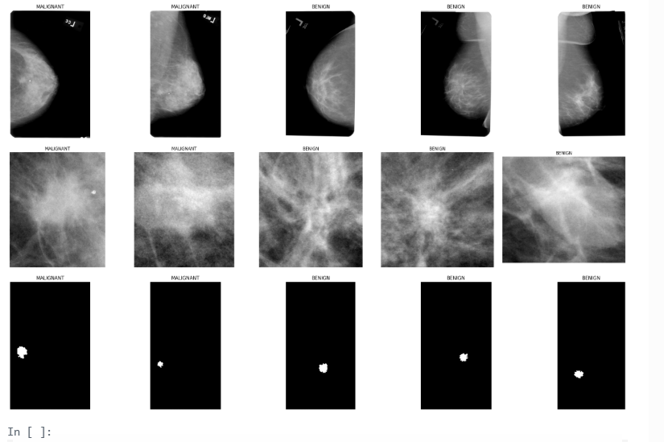
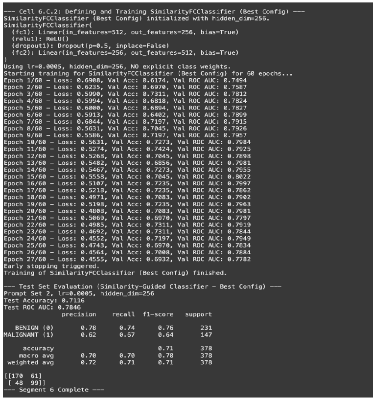
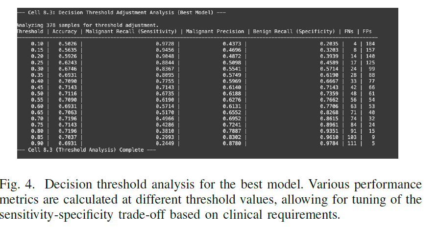

# 🧠 Breast Cancer Malignancy Prediction using CLIP

**Capstone Project II – DSCI 592 (Spring 2025)**  
This repository is part of the final submission for **Capstone Project II** coursework at Drexel University, focused on applying Vision-Language Models (VLMs) to medical imaging tasks.

We develop a custom classification pipeline using **OpenAI’s CLIP (ViT-B/32)** model and a custom Fully Connected classifier to predict breast cancer malignancy based on mammogram images. The project leverages advanced preprocessing, embedding refinement, and prompt engineering to improve interpretability and accuracy.

> 📌 **Core Contribution by Author**  
> The following notebooks were entirely developed in-house:
> - `CLIP_Modelv1.ipynb`
> - `PreProcessingBasicModel.ipynb`
> - `PreProcessing_with_basicmodels.ipynb`
> - `breast-cancer-eda.ipynb`
> - `data_clean_eda.ipynb`  
>  Other scripts and models are included for support and comparison purposes.
```
.
├── CLIP_Modelv1.ipynb # Custom SimilarityFCClassifier using CLIP embeddings
├── PreProcessingBasicModel.ipynb # Preprocessing pipeline, path correction, image mapping
├── PreProcessing_with_basicmodels.ipynb# Preprocessing + baseline models (e.g., logistic regression)
├── breast-cancer-eda.ipynb # Exploratory data analysis (EDA)
├── data_clean_eda.ipynb # Metadata cleaning and alignment
├── DSCI 592 - Pitch PPT.pptx.pdf # Project pitch presentation
├── S_MasterProject_Proposal_v2.docx # Project proposal document
├── README.md # This file
├── ex1.png # Sample image
├── open_clip_ex1.ipynb # External reference (OpenCLIP usage)
├── torch_clip.ipynb # External reference (Torch CLIP example)
├── CLIP_for_Breast_Cancer_TF.ipynb # External support (TensorFlow-based CLIP example)
├── CLIP_TF_CNN_Transformer.ipynb # External support (CNN-Transformer hybrid)
```
---

## 📊 Dataset: CBIS-DDSM

> Source: [TCIA CBIS-DDSM](https://wiki.cancerimagingarchive.net/display/Public/CBIS-DDSM)

- **Full Mammograms**: 2,857 images
- **Cropped ROIs**: 3,567 images
- **ROI Segmentation Masks**: 3,247 binary masks
- **Metadata**: BI-RADS scores, shape, margin, pathology labels (BENIGN/MALIGNANT), etc.

---

## ⚙️ Workflow Overview

### ✅ 1. Preprocessing (`PreProcessingBasicModel.ipynb`)
- Load and clean metadata from multiple CSVs
- Correct file paths and map UIDs
- Normalize and transform images (224×224, CLIP input format)
- Stratified train/val/test split

### 📈 2. Exploratory Data Analysis (`breast-cancer-eda.ipynb`)
- Visualize image dimensions, distribution, and modalities
- Analyze metadata patterns (shape, margin, BI-RADS)

### 🧠 3. Modeling (`CLIP_Modelv1.ipynb`)
- Extract 512-dim embeddings from CLIP ViT-B/32 (frozen)
- Build `SimilarityFCClassifier`: a 2-layer MLP that refines embeddings
- Use cosine similarity with descriptive text prompts as logits
- Train using `CrossEntropyLoss`

### ⚖️ 4. Evaluation
- Metrics: Accuracy, AUC, Precision, Recall, F1-Score
- Analyze threshold tuning for clinical use
- Compare with zero-shot CLIP and logistic regression

---

## 🧪 Performance Summary

| Model              | Accuracy | AUC  | F1 Score |
|-------------------|----------|------|----------|
| Logistic Baseline | ~68.4%   | 0.74 | 0.66     |
| Zero-Shot CLIP    | 76.2%    | 0.81 | 0.75     |
| Custom FC Head    | 72.2%    | 0.788| 0.71     |
| OpenCLIP          | 89.4%    | 0.94 | 0.89     |

---
## 📷 Visual Insights and Evaluation

Below are key visualizations and outputs from the project, highlighting data characteristics, model behavior, and performance across multiple dimensions.
### 📊 Image Dimension Distribution

To understand the dataset characteristics, we visualized the distribution of image dimensions using KDE plots.  
This shows the multimodal nature of image sizes, helping inform preprocessing choices like resizing.


### 📐 Aspect Ratio Consistency

A scatter plot of image height vs. width confirms a strong linear correlation, indicating consistent aspect ratios across samples.  
This validates the resizing step in the preprocessing pipeline.



### 🩻 CBIS-DDSM Dataset Overview

The CBIS-DDSM dataset includes original mammograms, cropped ROIs, and segmentation masks.  
This figure shows examples of both benign and malignant cases across these views.



### 🧠 Training Progress – Similarity-Guided Classifier

This figure shows the training logs of the best `SimilarityFCClassifier` configuration.  
Early stopping was triggered after 27 epochs, reaching a peak ROC AUC of ~0.79.



### ⚖️ Decision Threshold Analysis

To tune for clinical use cases (e.g., screening vs. diagnosis), we evaluated model metrics at different thresholds.  
Lower thresholds improved malignant recall; higher ones improved benign precision.




## 🔍 Highlights

- ✅ Vision-Language Learning using CLIP (frozen)
- ✅ Prompt engineering for medical classification
- ✅ Custom FC network trained via image-text similarity
- ✅ Preprocessing for >20,000+ paths using UID mapping
- ✅ Metadata-based error analysis

---

## 🚀 Future Work

- ✍️ Add **ChatGPT-like justification generation** from image embeddings
- 🔄 Fine-tune CLIP on mammogram-specific data
- 🧠 Introduce **Visual Question Answering (VQA)** capability
- ⚖️ Implement **Focal Loss** and **class-weight tuning** for imbalanced datasets

---

## 📚 Report and Proposal

- 📄 [`FinalReport.pdf`](./FinalReport.pdf) – Full methodology, EDA, model performance
- 🧠 [`S_MasterProject_Proposal_v2.docx`](./S_MasterProject_Proposal_v2.docx) – Research scope
- 🎤 [`DSCI 592 - Pitch PPT.pptx.pdf`](./DSCI%20592%20-%20Pitch%20PPT.pptx.pdf) – Slide deck

---

## 👨‍💻 Author Contribution

Developed and maintained by **Ram Kishore KV** and collaborators.

- All code and analysis notebooks marked above were authored by Ram.
- External notebooks were added only for architectural comparison or extension references.

---

## 📄 License

This project is for academic and research use only. Reuse requires citation and permission.

---

## 📬 Contact

Feel free to reach out via [GitHub](https://github.com/RamKishoreKV) or connect on LinkedIn for collaboration inquiries.
